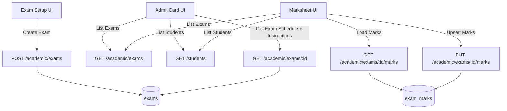

# Exam Setup, Admit Card, Marksheet — Backend API Spec (for Frontend Integration)

This document is meant for the **backend developer**. It describes the **data models**, **API endpoints**, **filters/scope rules**, and **validation/behavior** needed to support the current frontend modules:

- `Exam Setup` (`src/pages/Student/ExamSetup/ExamSetupPage.jsx`)
- `Admit Card` (`src/pages/Student/AdmitCard/AdmitCardPage.jsx`)
- `Marksheet` (`src/pages/Student/Marksheet/MarksheetModulePage.jsx`)

Today the frontend persists exams + marks in `localStorage`. This spec defines backend APIs so the frontend can replace `localStorage` with server persistence.

---

## Current Frontend Behavior (Important)

### Scope rule (section required only for 11–12)

- For classes **1–10**: exams are **class-wide** (no section/stream selection in UI).
- For classes **11–12**: exams are **class + section/stream scoped** (UI requires section/stream).

This scope rule is used in:
- Admit Card: which students are eligible for printing
- Marksheet: which students appear in marks entry / generate marksheet

---

## Flow Diagram (System)



---

## Entities / Data Models

Below are the recommended entities (field names can change, but keep the meaning).

### 1) Exam

Represents one exam for one class (and optionally one section for 11–12).

**Required fields**
- `id` (string / ObjectId)
- `schoolId`
- `sessionId`
- `name` (string) — exam name (e.g. "Half Yearly")
- `classId`
- `sectionId` (nullable) — required for classes 11–12, else null
- `instructions` (string, optional)
- `createdAt`, `updatedAt`

**Computed/denormalized (optional but helpful for frontend)**
- `sessionName`
- `className`
- `sectionName`

### 2) Exam Subject Config (Marking Rule)

Per exam, which subjects are included and their marking rules.

- `subjectId`
- `maxMarks` (number)
- `passMarks` (number)

### 3) Exam Schedule Item (Per Subject)

Per exam, per subject schedule.

- `subjectId`
- `examDate` (date, ISO string) — **date part used**
- `startTime` (string `"HH:mm"`)
- `endTime` (string `"HH:mm"`)

### 4) Exam Marks

Per exam, per student, per subject marks.

- `examId`
- `studentId`
- `subjectId`
- `value`:
  - number string (e.g. `"82"`) OR
  - `"AB"` for absent

Backend may store as:
- `isAbsent: boolean` + `marks: number|null`
OR keep `value` as a string. The frontend supports both as long as API returns a consistent normalized form.

---

## Frontend Expectations (Data Shape)

The frontend currently stores this shape in `localStorage["marksheet.exams.v1"]`:

```json
{
  "id": "exam_1719912345678",
  "examName": "Half Yearly",
  "session": "2025-26",
  "sessionId": "sess_001",
  "classId": "cls_5",
  "className": "Grade 5",
  "sectionId": "",
  "sectionName": "",
  "instructions": "Reach 30 min early...",
  "subjects": [
    { "subjectId": "sub_math", "subjectName": "Mathematics", "maxMarks": 100, "passMarks": 35 }
  ],
  "schedule": [
    { "subjectId": "sub_math", "subjectName": "Mathematics", "examDate": "2026-03-25", "startTime": "10:00", "endTime": "12:00" }
  ],
  "createdAt": "2026-03-20T09:00:00.000Z"
}
```

**Backend can return a different shape**, but recommended to keep the same semantics:
- exam meta: name + session + class + (optional) section + instructions
- included subjects with max/pass
- subject-wise schedule

---

## Required API Endpoints (Recommended)

All endpoints below assume school scoping via auth token (best) or `schoolId` param.

### A) Exams

#### 1) Create exam

`POST /academic/exams`

Request body:

```json
{
  "name": "Half Yearly",
  "sessionId": "sess_001",
  "classId": "cls_5",
  "sectionId": null,
  "instructions": "Reach 30 min early...",
  "subjects": [
    { "subjectId": "sub_math", "maxMarks": 100, "passMarks": 35 },
    { "subjectId": "sub_eng", "maxMarks": 100, "passMarks": 35 }
  ],
  "schedule": [
    { "subjectId": "sub_math", "examDate": "2026-03-25", "startTime": "10:00", "endTime": "12:00" },
    { "subjectId": "sub_eng", "examDate": "2026-03-27", "startTime": "10:00", "endTime": "12:00" }
  ]
}
```

Response (recommended):

```json
{
  "data": {
    "id": "exam_db_id",
    "name": "Half Yearly",
    "sessionId": "sess_001",
    "sessionName": "2025-26",
    "classId": "cls_5",
    "className": "Grade 5",
    "sectionId": null,
    "sectionName": null,
    "instructions": "Reach 30 min early...",
    "subjects": [
      { "subjectId": "sub_math", "subjectName": "Mathematics", "maxMarks": 100, "passMarks": 35 }
    ],
    "schedule": [
      { "subjectId": "sub_math", "subjectName": "Mathematics", "examDate": "2026-03-25", "startTime": "10:00", "endTime": "12:00" }
    ],
    "createdAt": "2026-03-20T09:00:00.000Z"
  }
}
```

#### 2) List exams (for dropdowns)

`GET /academic/exams?sessionId=&classId=&sectionId=`

Filters:
- `sessionId` (optional but recommended; frontend uses “active session”)
- `classId` (optional)
- `sectionId` (optional)

Response:

```json
{
  "data": [
    {
      "id": "exam_db_id",
      "name": "Half Yearly",
      "sessionId": "sess_001",
      "sessionName": "2025-26",
      "classId": "cls_5",
      "className": "Grade 5",
      "sectionId": null,
      "sectionName": null
    }
  ]
}
```

Frontend uses this for:
- Marksheet → Exam dropdown
- Admit Card → Exam dropdown

#### 3) Get exam details (schedule + subjects)

`GET /academic/exams/:examId`

Must return:
- `instructions`
- `subjects` (with max/pass)
- `schedule` (per subject)
- `classId/className` and `sectionId/sectionName` for scope filtering

#### 4) Update exam (optional but useful)

`PUT /academic/exams/:examId`

Allows fixing typos/schedule changes after creation.

#### 5) Delete exam (optional)

`DELETE /academic/exams/:examId`

If implemented, decide policy for existing marks/admit cards:
- either cascade delete marks
- or block delete if marks exist

---

### B) Admit Card Support

Admit card generation in the frontend requires:
- exam details (subjects + schedule + instructions)
- student list filtered by exam scope

The student data is already fetched from:
- `GET /students`

If you want to make admit card faster, add a scope endpoint:

#### Optional: Students by exam scope

`GET /academic/exams/:examId/students`

Backend filters students by:
- `classId` for classes 1–10
- `classId + sectionId` for classes 11–12

Response includes the fields used on the admit card UI:
- `name`
- `admissionNumber`
- `rollNumber`
- `className`
- `section`

Bulk printing ordering in frontend:
- sort by section, then roll number, then admission number
(Backend can return already sorted, but frontend can also sort.)

---

### C) Marks Entry + Marksheet

#### 1) Get marks for an exam (and optionally a student)

`GET /academic/exams/:examId/marks?studentId=`

Return normalized per student map or an array.

Option 1 (array):

```json
{
  "data": [
    { "studentId": "stu_101", "subjectId": "sub_math", "value": "82" },
    { "studentId": "stu_101", "subjectId": "sub_eng", "value": "AB" }
  ]
}
```

Option 2 (map; closest to current frontend localStorage):

```json
{
  "data": {
    "stu_101": { "sub_math": "82", "sub_eng": "AB" },
    "stu_102": { "sub_math": "91", "sub_eng": "88" }
  }
}
```

#### 2) Upsert marks (bulk)

`PUT /academic/exams/:examId/marks`

Request body (bulk upsert):

```json
{
  "marks": {
    "stu_101": { "sub_math": "82", "sub_eng": "AB" },
    "stu_102": { "sub_math": "91", "sub_eng": "88" }
  }
}
```

Backend validation rules (match frontend):
- allow `"AB"`
- else numeric \(0..maxMarks\) based on exam subject config
- reject unknown `studentId` (optional) or ignore silently (not recommended)
- reject unknown `subjectId` for that exam (recommended)

Response:

```json
{ "message": "Marks saved", "data": { "updated": 42 } }
```

#### 3) Lock / publish marks (optional)

Optional endpoint if you want to prevent edits after finalization:

`POST /academic/exams/:examId/marks/lock`

Frontend then disables marks entry if locked.

---

## Validation Rules (Backend Should Enforce)

These match the current UI validations.

### Exam Setup validations

- `name` required
- `sessionId` required
- `classId` required
- If class is 11 or 12 (or if your school uses streams):
  - `sectionId` required
- At least one subject required
- For each subject:
  - `maxMarks > 0`
  - `0 <= passMarks <= maxMarks`
- For each selected subject schedule:
  - `examDate`, `startTime`, `endTime` required
  - recommended: validate time ordering (`startTime < endTime`)

### Marks validations

- value is `"AB"` OR a number
- if number: must be within `0..maxMarks` for that subject (as configured in the exam)

---

## Notes About Dates & Printing

### Admit Card date format

Frontend shows schedule dates as `dd/mm/yy` (display only). Backend should return ISO date strings (e.g. `"2026-03-25"`) or full ISO timestamps.

### Printing

Printing is done by frontend using browser print. Backend does not need to generate PDFs unless you want a future enhancement:
- Optional: `GET /academic/exams/:id/admit-cards.pdf`
- Optional: `GET /academic/exams/:id/marksheets.pdf`

---

## Migration Plan (LocalStorage → API)

Frontend currently uses:
- `localStorage["marksheet.exams.v1"]`
- `localStorage["marksheet.marks.v1"]`

Once APIs exist, frontend can replace:
- Load exams from `GET /academic/exams`
- Create exam via `POST /academic/exams`
- Load marks via `GET /academic/exams/:id/marks`
- Save marks via `PUT /academic/exams/:id/marks`

Everything else in the UI (printing/layout/scope filtering) stays mostly unchanged.

